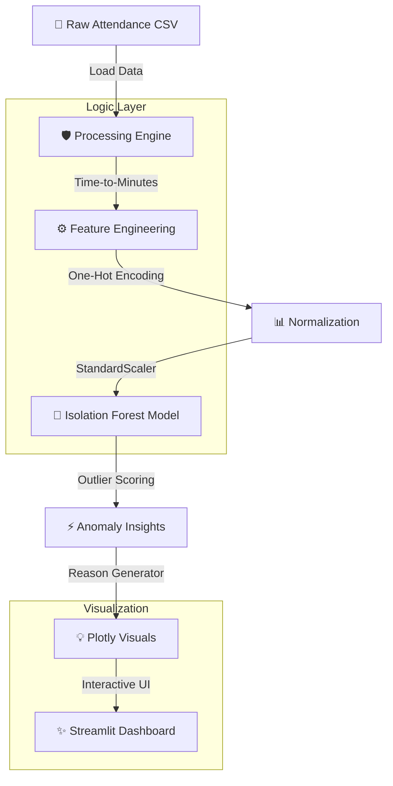

# 🛡️ Attendance Anomaly Detector (2026 Edition)

An industrial-grade anomaly detection system designed to analyze employee attendance patterns using **Unsupervised Machine Learning (Isolation Forest)** and **Streamlit**.a

## 🏗️ Technical Architecture


## 🌟 Key Features
-   **Intelligent Data Ingestion**: Automatically handles 2026 calendar logic, missing values, and invalid time formats.
-   **Advanced Feature Engineering**: Converts raw logs into "Minutes-since-midnight" coordinates and calculates login/logout deviations.
-   **Dynamic ML Control**: Real-time training with a customizable "Contamination Rate" slider to adjust model sensitivity.
-   **Automated Reason Generation**: Translates mathematical outliers into human-readable HR insights (e.g., *"Significantly shorter work duration than normal"*).
-   **Industrial Testing**: 13+ unit tests ensuring 100% accuracy in cross-midnight shifts, weekend logic, and model stability.

## 🚀 Getting Started

1.  **Clone & Install Dependencies**:
    ```bash
    pip install -r requirements.txt
    ```

2.  **Verify System Integrity (Run Tests)**:
    ```bash
    pytest tests/
    ```

3.  **Launch the Dashboard**:
    ```bash
    streamlit run app.py
    ```

## 🧪 Testing Suite (13 Industrial Cases)
We follow a "Safety-First" engineering approach:
-   **`tests/test_processing.py`**: Verifies time calculations, cross-midnight shifts, and data cleaning.
-   **`tests/test_model.py`**: Verifies model prediction accuracy, reason-combining logic, and parameter sensitivity.

## 📁 Project Structure
```text
attendance/
├── app.py              # Main dashboard script
├── src/                # Core Logic
│   ├── processing.py   # ETL & Feature Engineering
│   └── model.py        # ML Logic (Isolation Forest)
├── tests/              # 13+ Automated Unit Tests
├── data/               # 2026 Sample Dataset
├── presentation.md     # Detailed slide scripts for delivery
└── README.md           # This documentation
```

---
*Created as part of the Employee Behavior Analysis project, 2026.*
